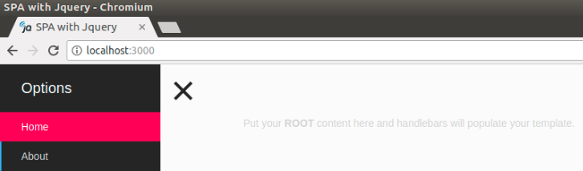

# SPA Website Boilerplate



SPA website boilterplate built using Webpack. This boilterplate features following:

- Webpack
- ES6
- Jquery
- Bootstrap
- Font Awesome
- Sass
- Handlebars
- Live reload using Browsersync

## Getting Started

Clone the repo

```sh
git clone https://github.com/jrichardsz/spa-bootstrap-handlebars-webpack-kickstarter.git
```

Install the dependencies

```sh
npm install
```

Run script to start devlopment
```sh
npm run start
```

For distribution folder run the following command and it will create a dist folder which can be placed on a server
```sh
npm run build
```

## Regards

[https://github.com/jackvial/jquery-spa-example.git](https://github.com/jackvial/jquery-spa-example.git)

## Coming soon

- Add error template
- Convert left nav bar functions to class
- Parametrize container id in js files
- Renderize json data in template using handlebars
- Add test
- Upload to heroku


## License
[MIT](LICENSE)
